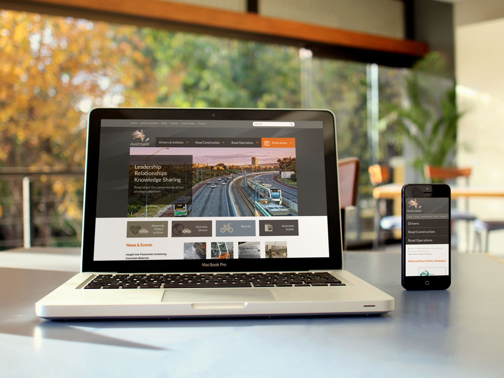

---
# http://learn.getgrav.org/content/headers
title: Austroads
slug: austroads
image: austroads.jpg
# menu: 10 Easy Steps to Improve Your LinkedIn Profile
published: true
publish_date: 06-12-2012
# unpublish_date: 06-12-2012
# template: false
# theme: false
visible: true
summary:
    enabled: true
    format: short
    size: 128
taxonomy:
#    migration-status: review
#    category: [Social Media]
#    tag: [LinkedIn,Online Presence,LinkedIn,Online Presence]
author: Peter Bui
metadata:
    author: peter@pbwebdev.com.au
    description: Website design and development case study of Austroads. Find our how we pieced together the Austroads website build project.
    keywords: Austroads, website case study, web project
    robots: ALL
---

===

## Overview

Austroads is the main body and organisation that looks after all of the road designs and regulations in Australia and New Zealand. They're a large organisation made up of engineers, project managers and consultants writing the policies, publications and guidelines in regards to road design, road safety, driving regulations and much more.

Austroads needed a new website design that better communicated what they did for their different audiences. They also required an upgrade of their Joomla 1.5 website which was becoming dated and less secure in comparison to the latest versions of Joomla!

The brand new website needed to be mobile friendly, fully responsive and work on all devices and also integrate with their existing services and developed solutions.

## Solution

PB Web Development provided Austroads with a full solution from design, content architecture and development of the new website.

Both teams worked together to come up with a clear and cohesive site structure that worked best for the target audiences while making the content as accessible as possible.

Responsive technologies were employed and the new website was built using the T3 framework,based off of Bootstrap, which made things easy to deploy and maintain.

Testing and content construction of the website was done jointly between Austroads and PB Web Development.

## Services Provided

* Web design
* Site architecture
* Joomla customisation and implementation
* Security measures
* Custom web development

## Visit the site

* <a href="http://www.austroads.com.au" target="_blank">Austroads</a>