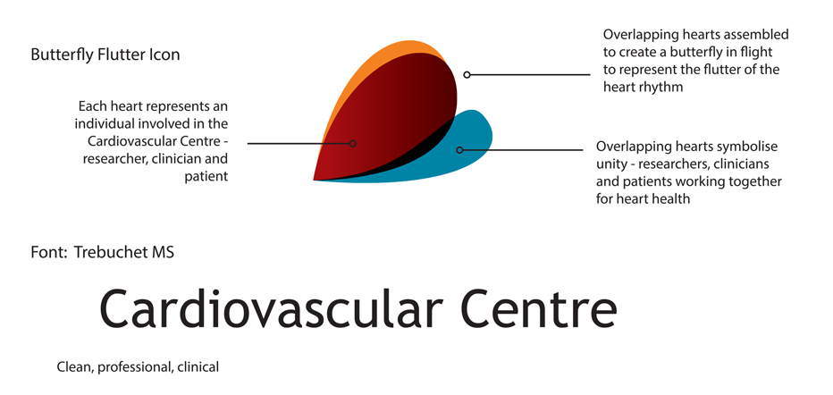

===

## Overview

The Cardiovascular Centre is a diverse and highly trained team of Cardiologists who offer a full range of adult and paediatric cardiology services in Adelaide. The Centre needed a corporate identity as well as a new online presence to better present themselves to the public.

The old website and branding had served its purpose over time and a new look and feel for the brand was required to better sell its services and show the expertise of the cardiologists that work at the centre.

## Solution & Digital Services Provided

### Cardiovascular Centre Corporate Branding

PB Web Development started with a branding exercise that looked at all the different aspects of the Cardiovascular Centre. From there a branding guide and style guide was developed for the Centre to use across all of its print and digital assets.

The team produced business cards, design assets, the logo and much of the print ready material used by the heart centre.

## Web Design & Development

PB Web Development then went on to deliver the online digital presence in the form of the website, providing a full design, development and hosting package for the Centre.

The website design went through several rounds of reviews and changes to come up with the final deliverable compositions. It also took into account many of the different aspects of the content management system, Joomla!, where we were using for the build of the website.

Joomla was chosen for its flexibility and customisation abilities allowing the Cardiovascular Centre the ability to keep a secure and scalable website for the future.

## Managed Joomla Hosting

The Cardiovascular website is hosted on a tier 1 level hosting with our hosting partners Anchor. Being able to provide local Australian hosting at high speed, latency, security and management is key for many of our web digital clients.

## Private Joomla Training

The team from PB Web Development provided the team members private training sessions to help fully understand how to manage and update the website.

Training was provided on site within the premises of the Royal Adelaide Hospital.

## Services Provided

* <a href="/what-we-do/branding-and-strategy">Branding & Corporate Identities</a>
* <a href="/what-we-do/joomla">Joomla Web design & development</a>
* <a href="/what-we-do/web-development">Web development</a>
* <a href="/what-we-do/social-media">Social media</a>
* <a href="/what-we-do/managed-hosting">Managed Hosting</a>

## Visit the site

* <a title="Cardiovascular Centre" href="http://www.cardiovascularcentre.com.au" target="_blank">Cardiovascular Centre</a>