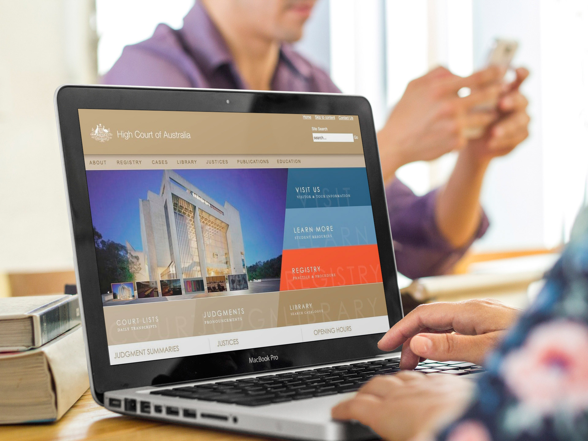

===

## Overview

The High Court of Australia required a new website that bought the High Court's web presence into the modern times. The High Court was already familiar with Joomla as they were using it for their internal Intranet site and wanted to use the fantastic open source platform for their internet website.

The new High Court of Australia website would also have to meet the new WCAG 2.0 standards set out by the Australian Government earlier in 2010.

## Solution

PB Web Development created a online platform for the High Court of Australia to be able to present information to the public easily. The template created for the High Court allowed for a high level of accessibility as well as meeting the required levels of WCAG 2.0.

Template features such as relative sizing rather than exact pixel sizing allowed for a flexible increase and decreasing of the font size across browsers. Keyboard navigation as well as accessible content was also a key factor in the design and development of the website.

A mobile template of the website was created to allow smart phones to access the website easily. The lightweight mobile template allowed for fast rendering and fast download of page assets as there were less items to download.

PB Web Development also provided a dedicated hosting environment which allowed for ample resources for security, monitoring and future growth of the website.

Content migration from the old High Court of Australia website was also a lengthy task. PB Web Development provided the resources to migrate the majority of the content across over to the new website platform.

## Services Provided

* Web Design
* Web Development
* Joomla
* Dedicated Hosting
* Consultation

## Recognition

* J!O.S.C.A.R Nominee for Best Government Website 2011

## Visit the site

* High Court of Australia