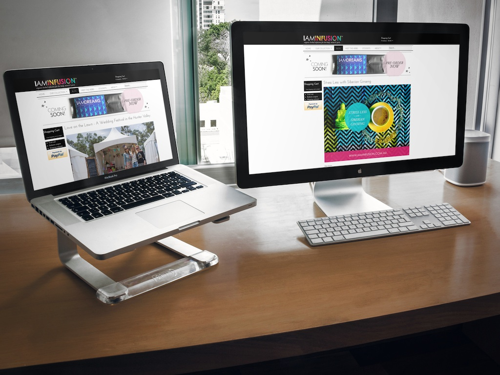

---
# http://learn.getgrav.org/content/headers
title: I Am Infusion
slug: i-am-infusion
image: i-am-infusion.jpg
# menu: 10 Easy Steps to Improve Your LinkedIn Profile
published: true
publish_date: 06-12-2012
# unpublish_date: 06-12-2012
# template: false
# theme: false
visible: true
summary:
    enabled: true
    format: short
    size: 128
taxonomy:
#    migration-status: review
#    category: [Social Media]
#    tag: [LinkedIn,Online Presence,LinkedIn,Online Presence]
author: Peter Bui
metadata:
    author: peter@pbwebdev.com.au
    description: 
    keywords: I Am Infusion, Shopify, website case study
    robots: ALL
#      og:
#          title: The Rock
#          type: video.movie
#          url: http://www.imdb.com/title/tt0117500/
#          image: http://ia.media-imdb.com/images/rock.jpg
#  cache_enable: false
#  last_modified: true

---

===

## Overview

I Am Infusion is a herbal organic tea range that was designed and developed for the tea and herbal infusion lovers out there. The tea is an all organic and natural blend made to uplift the mind, body and spirit. I Am Infusion wanted to change the tea and herbal drinks industry by creating something new, unique and exciting for the rest of the world. I Am Infusion needed everything from web design and e-commerce all the way to print and marketing material.

I Am Infusion needed to create its complete branding, packaging, marketing material and online presence through social media, email marketing and the website.

The branding and the online presence of the brand had to match the goals and ideals of what it was trying to achieve with the brand and this was to match across all forms of online and offline communications.

## Solution

PB Web Development provided I Am Infusion with the complete client end to end experience by turning the idea and concept into a working and profitable business.

Everything was design and cared for in-house from the logo and corporate identity, packaging design, written copy and photography, web design, e-commerce development and online marketing and social media. Every last point was looked at and taken care of by the team at PB Web Development.

The team consulted and brain stormed various layouts, ideas and ways that brand could identify and engage with its target audience.

During the development process, we can up with several ideas, concepts and online marketing strategies to take the herbal tea infusions from an idea to a living and thriving online business.

PB Web Development was responsible for implementing and rolling out the online solution using Joomla (Content management system) and MijoShop (E-commerce solution) as the solution as well as various online marketing material used in email campaigns and social media.

## Services Provided

* Branding
* Product development
* Marketing material
* Web design
* Web development
* Social media
* Email marketing
* E-commerce solution
* Web hosting

## Visit the site

* <a title="Herbal Organic Tea Infusions" href="http://www.iaminfusion.com.au" target="_blank">I Am Infusion</a>