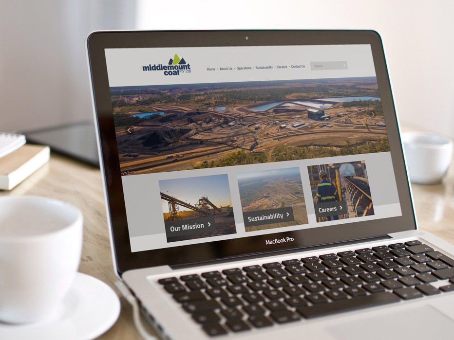

---
# http://learn.getgrav.org/content/headers
title: Middlemount Coal
slug: middlemount-coal
image: middlemount-coal.jpg
# menu: 10 Easy Steps to Improve Your LinkedIn Profile
published: true
publish_date: 06-12-2012
# unpublish_date: 06-12-2012
# template: false
# theme: false
visible: true
summary:
    enabled: true
    format: short
    size: 128
taxonomy:
#    migration-status: review
#    category: [Social Media]
#    tag: [LinkedIn,Online Presence,LinkedIn,Online Presence]
author: Peter Bui
metadata:
    author: peter@pbwebdev.com.au
    description: 
    keywords: Middlemount coal, Joomla, website case study
    robots: ALL
#      og:
#          title: The Rock
#          type: video.movie
#          url: http://www.imdb.com/title/tt0117500/
#          image: http://ia.media-imdb.com/images/rock.jpg
#  cache_enable: false
#  last_modified: true

---

===

## Overview

Middlemount Coal needed a website so that they could communicate to the public about the mining project at Middlemount. Environmental policies and initiatives are a requirement by Government to be made accessible to the public.

Middlemount Coal wanted an easy to use website that allowed for them to update the information and get the messages out as they needed.

## Solution

PB Web Development create a brand new mining website that fitted their existing branding of the company.

With a modern look and feel, it gave Middlemount the flexibility of easily communicating to the public what Middlemount Coal is all about.

The project included the full design and development of the mining website using the Joomla content management system.

## Services Provided

* Web Design
* Web Development
* Social Media
* Windows Server Maintenance

## Visit the site

* <a href="http://middlemountcoal.com.au" target="_blank">Middlemount Coal</a>