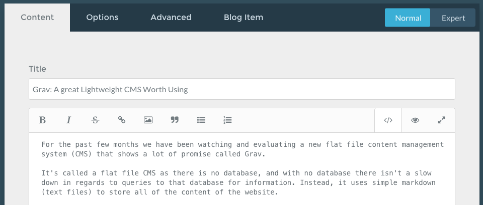
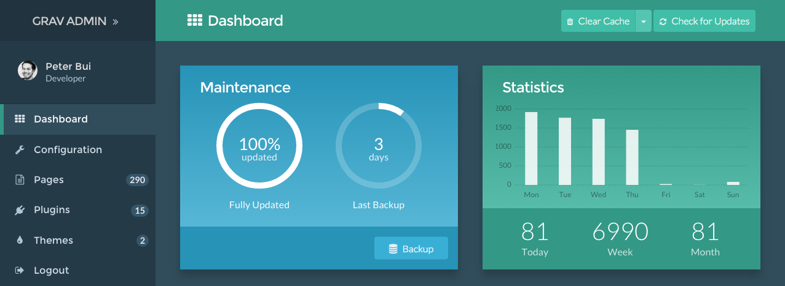
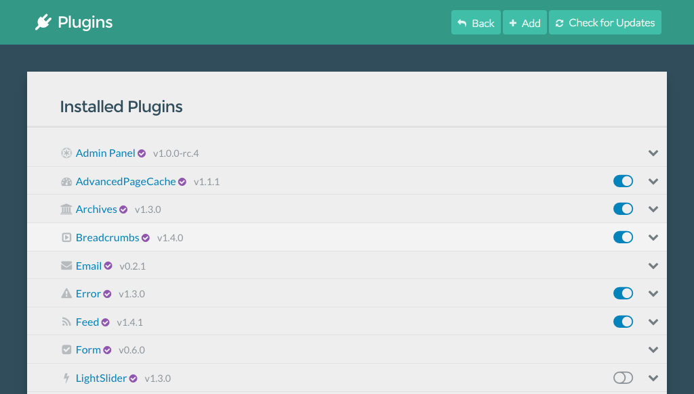
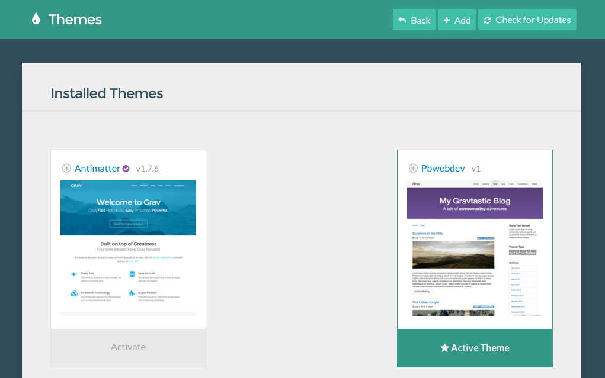

For the past few months we have been watching and evaluating a new flat file content management system (CMS) that shows a lot of promise called Grav for our clients that want simple business brochure style websites. 

We've been eagerly waiting for more updates and releases as some of the features of the CMS are quite exciting for developers and for small business owners.

## Flat File CMS?

It's called a flat file CMS as there is no database storing all of the content of the website, and with no database there isn't a slow down in regards to queries (retrieval) to that database for information. Instead, it uses simple markdown (text files) to store all of the content of the website.

Initially built for what we believed was developers using Markdown for content publishing, Twig templating for the building of the themes and YAML for the configuration of the site and plugins, but Grav has grown up over the last few months with the introduction of its own admin interface, one that I'm currently using to publish this very blog post.

The Grav Admin interface is almost stable at the time of writing this release meaning it will no longer be just a CMS for developers but all other non technical users can now start using Grav in all its glory.

It's ready for developers and content writers/business owners to start using.

## Whats the Big Deal?

Yes, you may be asking yourself what's the big deal about another CMS, when there are others like Joomla!, WordPress and Drupal which are all do dominate in the market at the moment. Why wouldn't this one make a difference?

### Developer Friendly

Grav is built on modern design principles and modern development tools. Little things like being installed with Composer making really easy to manage dependencies for your projects, or integrating in third party development libraries in your project.

Use of logicless templates with Twig, and simple clean 'What You Mean Is What You Get' (WYMIWUG) editors keep clean clean code and output.

Templating and theming is also a dream with being able to work with any template framework you want. We're currently using Bootstrap3 as our base templates but you can use anything you want.

Very flexible and not being locked into any particular framework makes things quite nice.

It means you can have a great looking website from just about any designer or developer!

### Speed Optimised

It's fast! Out of the box it is fast with page speed load times for some of our websites under 0.5 seconds and a website home page footprint of less than 300kb.

Speed is one of those factors for website usability and search engine optimisation. A faster loading website can lead to a better ranking website in terms of search engine results.

### Super Simple Admin Interface

Clients can simple edit their content and get blog posts online with out the worry of clutter, formatting or other things content publishers shouldn't need to worry about.

But where a site admin actually needs to do some site configuration and administration, the tools and power is all there too.

With a simple plugin manager, 

and a simple theme configuation screen.

## Conclusion

A lot of the time we just want to be able to build a quick simple website that advertises a business with a contact form and custom landing pages. That's it and Grav lets us do so quickly and easily with very little effort, cheap hosting and most importantly, very little maintenance afterwards.

Less maintenance means less development and more time focused on helping our clients drive traffic and build business which is the end result of all websites we build.

If you're interested in finding our more about Grav or getting your own demo site to try out, just **leave a comment** and we'll get back to you with details of your very own Grav website to try out for your business.